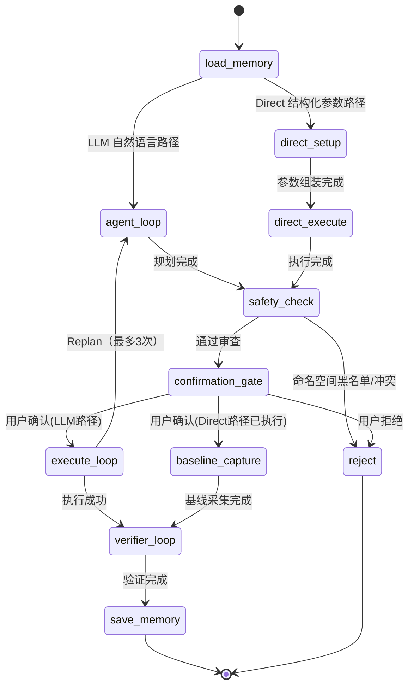

# BLADE AI 介绍文档

[](../LICENSE)

> 说人话就能注入故障，不用背命令。

## 目录

- [是什么](#是什么)
- [为什么需要它](#为什么需要它)
- [核心能力矩阵](#核心能力矩阵)
- [架构总览](#架构总览)
- [三阶段 ReAct 状态机](#三阶段-react-状态机)
- [四层纵深安全体系](#四层纵深安全体系)
- [渐进式技能加载](#渐进式技能加载)
- [三层记忆系统](#三层记忆系统)
- [双模式架构](#双模式架构)
- [技术栈](#技术栈)
- [与 ChaosBlade 的边界](#与-chaosblade-的边界)
- [演进规划](#演进规划)

---

## 是什么

**BLADE AI 是 ChaosBlade 生态的智能代理层。** 底层调用 ChaosBlade 执行故障注入，上层增加意图理解、安全审查、效果验证、安全恢复和结构化报告等编排能力，让故障演练从"手写命令"变成"对话完成"。

它不是 ChaosBlade 的替代品 —— ChaosBlade 仍然是注入引擎，BLADE AI 是让你更安全、更省心地使用它的智能助手：

- **ChaosBlade 负责"如何注入"** —— 怎样在 K8s 中给 Pod 注入 CPU 压力，怎样让网络丢 60% 的包
- **BLADE AI 负责"如何安全、完整地完成一次演练"** —— 注入前确认目标资源是否存在、是否在黑名单、是否与已有实验冲突；注入后验证故障是否真实生效；演练结束后保证可靠恢复

## 为什么需要它

混沌工程的核心目标不是"制造故障"，而是"验证系统在故障下的韧性"。但实际操作中，一次完整的故障演练远不止执行一条 `blade create` 命令 —— 你还需要：

1. 确认目标资源是否存在 / 是否能定位到正确的 Pod
2. 确认操作是否安全（命名空间、与现有实验的冲突、参数合法性）
3. 注入后验证故障效果是否真实生效（不是 blade 返回 OK 就完事，要看 `kubectl top pod` 是否真的飙到 80%）
4. 演练结束后能否可靠恢复 —— 进程崩了、网络断了、blade UID 丢了怎么办

这些编排环节往往比注入本身更耗时、更易出错。BLADE AI 把整个演练流程（**意图 → 安全 → 注入 → 验证 → 恢复**）封装为一个完整的自动化闭环，确保不遗漏、不偷懒。

### 为什么不能直接用通用 LLM Agent + ChaosBlade Skill？

通用 Agent 的 Skill 本质是**提示词注入** —— 告诉 LLM "应该做什么"，但 LLM 可能跳过、遗漏、忘记。

BLADE AI 的安全检查（资源白名单、Dry-Run 预演、人机确认门、超时自动恢复）必须**嵌入 LangGraph 状态机执行引擎** —— 无论 LLM 输出什么，这些节点一定会执行。同样，恢复的三种分支结果（成功 / 失败需重试 / 实验已丢失需告警）是状态机的**条件边硬编码**，LLM 的线性指令序列无法保证降级路径的执行。

> **Skill 是知识层（告诉 Agent 怎么做），Agent 是责任层（保证安全执行和完整恢复）。两者互补而非替代。**

---

## 核心能力矩阵

| 能力维度 | 说明 | 技术实现 |
|---------|------|---------|
| **意图理解** | 自然语言描述故障意图，自动匹配技能并生成执行计划 | LLM + 技能决策树 |
| **安全审查** | 四层纵深防御，确保任何注入操作都经过多重校验 | ToolGuard + Safety Check + Confirmation Gate + Loop Max |
| **故障注入** | 调用 ChaosBlade 在 K8s 集群中注入真实故障 | blade create / kubectl |
| **效果验证** | 两层验证确认故障真实生效（操作正确性 + 效果真实性） | Layer 1 确定性验证 + Layer 2 语义性验证 |
| **安全恢复** | 独立恢复链路，支持成功/失败/丢失三种分支 | Recover Graph + 强制清理降级路径 |
| **结构化报告** | 每次演练生成 JSON 完整报告，支持审计和集成 | TaskTrace + TaskStore 持久化 |
| **可观测性** | 实时 SSE 流式输出 + Token 追踪 + 执行追踪 | StatusTracker + TracingCallback |

---

## 架构总览

```
┌─────────────────────────────────────────────────────────────┐
│                        接入层                                │
│   ┌──────────────┐    ┌────────────────────────────────┐   │
│   │ CLI (Typer)  │    │ Server (FastAPI + SSE)         │   │
│   │ AgentRunner  │    │ REST + Stream routes           │   │
│   └──────┬───────┘    └────────────┬───────────────────┘   │
│          │                         │                        │
│          └───────────┬─────────────┘                        │
│                      ▼                                      │
├─────────────────────────────────────────────────────────────┤
│                        编排层                                │
│   ┌─────────────────────────────────────────────────────┐   │
│   │              LangGraph StateGraph                    │   │
│   │  ┌─────────┐   ┌──────────┐   ┌─────────────────┐  │   │
│   │  │ Phase 1 │ → │ Safety   │ → │ Phase 2         │  │   │
│   │  │ 规划    │   │ Check    │   │ 执行            │  │   │
│   │  └─────────┘   └──────────┘   └─────┬───────────┘  │   │
│   │                                     ▼               │   │
│   │                           ┌─────────────────┐       │   │
│   │                           │ Phase 3         │       │   │
│   │                           │ 验证            │       │   │
│   │                           └─────────────────┘       │   │
│   └─────────────────────────────────────────────────────┘   │
│   AgentState (统一状态模型) + Router (条件路由)               │
├─────────────────────────────────────────────────────────────┤
│                        能力层                                │
│   ┌──────────┐  ┌──────────┐  ┌────────────────────────┐   │
│   │ 工具系统 │  │ 技能系统 │  │ 记忆系统               │   │
│   │ Blade    │  │ Tier 1-3 │  │ Working / Session /    │   │
│   │ Kubectl  │  │ 渐进加载 │  │ Operational Memory     │   │
│   │ Guard    │  │ Registry │  │                        │   │
│   └──────────┘  └──────────┘  └────────────────────────┘   │
├─────────────────────────────────────────────────────────────┤
│                        基础设施层                            │
│   ┌──────────┐  ┌──────────┐  ┌────────────────────────┐   │
│   │ 持久化   │  │ 可观测性 │  │ 配置管理               │   │
│   │ SQLite   │  │ Tracer   │  │ pydantic-settings      │   │
│   │ PG(可选) │  │ Tracker  │  │ 四级优先级             │   │
│   │ Checkpt  │  │ Stream   │  │                        │   │
│   └──────────┘  └──────────┘  └────────────────────────┘   │
└─────────────────────────────────────────────────────────────┘
```

---

## 三阶段 ReAct 状态机

核心是 LangGraph 三阶段 ReAct 状态机。一条完整的故障注入链路包含三个性质截然不同的子任务：

- **Phase 1 规划** — 理解意图 → 匹配技能 → 查询目标状态 → 生成执行计划。需要丰富的上下文（技能目录、K8s 资源信息），LLM 需要较大的思考空间
- **Phase 2 执行** — 调用 ChaosBlade 创建实验 → 验证返回。需要精准的工具调用和严格的错误处理，不需要冗长的上下文
- **Phase 3 验证** — 确认故障效果真实生效 → 确认可恢复。有自己的时间策略（延迟等待、轮询重试），与执行阶段的即时反馈模式完全不同

如果用一个巨大的 ReAct 循环处理所有阶段，会导致 Prompt 臃肿、LLM 行为不稳定、错误处理粗糙。三阶段分离的核心价值：每个阶段有独立的 Prompt 模式、工具集和循环上限，LLM 在每个阶段只需要关注当前阶段的任务。



### 关键设计决策

- **双路径** — LLM 路径（灵活）+ Direct 路径（确定性、零 LLM），共享安全审查和验证。两条路径在 `safety_check` 处汇合 —— Direct 路径只是跳过了 LLM 规划，**不跳过任何安全环节**
- **Chat 路由** — 用户经常问"你能做什么？""支持哪些故障？"，这些非故障请求不应该走注入流程。Agent 识别后直接对话回答，不走安全检查和确认门
- **Replan 机制** — Phase 2 执行失败不等于任务失败。如果遇到可恢复的错误（目标资源不存在、参数不兼容），Router 将流程回退到 Phase 1 重新规划，最多 3 次。这让 Agent 具备了应对动态 K8s 环境的自适应能力
- **两层验证** — Layer 1 确认 blade 实验创建成功（确定性），Layer 2 确认故障效果真实生效（语义性，LLM 读取技能验证章节 + kubectl 轮询）。故障效果有 5-30 秒延迟，Layer 2 采用"乐观验证"策略：最少 3 次检查（间隔约 10 秒），任一确认即通过
- **独立 Recover Graph** — 恢复有自己的两层验证体系 + `--force` 降级路径，支持 ChaosBlade 和非 ChaosBlade（kubectl scale/cordon/taint 等）两种故障类型的恢复

---

## 四层纵深安全体系

安全不是单点校验，而是多层递进。每层有明确的职责边界：

```
用户输入
  │
  ▼
┌─────────────────┐
│ 1. ToolGuard    │ ← 命令级：白名单(blade/kubectl/df/ping/sleep)
│                 │   + 黑名单(rm -rf, | bash, 反引号注入)
│                 │   + kubectl 子命令白名单
└────────┬────────┘
         ▼
┌─────────────────┐
│ 2. Safety Check │ ← 语义级：命名空间黑名单(kube-system默认禁止)
│   (规则引擎)    │   + 冲突检测(重叠实验标记warning)
│   无 LLM 参与   │   + 目标存在性验证
└────────┬────────┘
         ▼
┌─────────────────┐
│ 3. Confirmation │ ← 人工级：interrupt()暂停
│    Gate         │   等待 approve/reject
└────────┬────────┘
         ▼
┌─────────────────┐
│ 4. Loop Max     │ ← 系统级：每阶段循环上限
│                 │   agent≤50, execute≤50, verifier≤30
│                 │   recover verifier≤30, recursion≤150
└─────────────────┘
```

> **Safety Check 是纯规则引擎，不依赖 LLM —— 这是刻意的设计决策。**
>
> LLM 可以参与"如何注入"的决策，但不能参与"是否可以注入"的裁决。把安全审查交给 LLM，等于把钥匙交给被审查的人。

---

## 渐进式技能加载

故障注入知识通过 Skill 文件管理，采用三级渐进加载避免 Token 膨胀：

| Tier | 时机 | 加载内容 | Token 开销 |
|------|------|---------|-----------|
| Tier 1 Discovery | Agent 启动时 | frontmatter（name + description） | ~100 token/skill |
| Tier 2 Activation | LLM 调用 `activate_skill` 时 | 完整 SKILL.md body（注入步骤、参数说明、验证指令） | <5000 token/skill |
| Tier 3 Execution | 指令引用时 | `scripts/`、`references/` 中的具体文件 | 按需 |

**为什么不全量加载？** 20+ 技能的完整内容会膨胀到 10 万 token 以上，不仅消耗巨大，还会稀释 LLM 对关键指令的注意力。渐进加载让 LLM 先看"菜单"（Tier 1），再"点菜"（Tier 2），最后"享用"（Tier 3）。

新增故障类型只需三步：在 `skills/` 下创建子目录 → 编写 `SKILL.md` → Server 模式自动热加载（watchdog 500ms 防抖），CLI 模式重启后生效。**无需修改核心代码。**

---

## 三层记忆系统

| Layer | 名称 | 存储位置 | 生命周期 | 核心机制 |
|-------|------|---------|---------|---------|
| 1 | Working Memory | 内存（messages 列表） | 单次 Graph 执行 | 工具输出截断（5000字符）+ Token 计数 |
| 2 | Session Memory | `~/.blade-ai/memory/sessions/` | 单次任务 | LLM 压缩摘要（6段式）+ JSONL 原始日志 |
| 3 | Operational Memory | `~/.blade-ai/memory/experiments/` + `AGENT.md` | 跨任务 | 实验历史（冲突检测）+ 经验积累 |

统一入口 `PreReasoningHook` 在每次 LLM 推理前执行：工具输出截断 → Token 计数 → 上下文检查 → 触发压缩/持久化。当 token 估算超过 `context_max_tokens × compact_ratio`（默认 128K × 0.85）时，调用 LLM 将历史消息压缩为结构化摘要，保留三类关键信息（用户原始意图、已执行操作、当前状态），确保压缩后 Agent 仍能做出正确决策。

---

## 双模式架构

```
                ┌─────────────────────────┐
                │    CLI (Typer)          │
                │  config set mode ...    │
                └──────┬──────────┬───────┘
          mode=local   │          │  mode=server
                       ▼          ▼
                ┌──────────┐  ┌──────────┐
                │ AgentRun │  │ AgentCli │
                │  ner     │  │  ent     │
                │ (同进程) │  │ (HTTP)   │
                └────┬─────┘  └────┬─────┘
                     │             │
                     │      ┌──────▼──────────┐
                     │      │ FastAPI Server  │
                     │      │ + SSE Stream    │
                     │      └──────┬──────────┘
                     │             │
                ┌────▼─────────────▼────┐
                │   Agent Factory       │
                │   (统一构建 Graph)    │
                └───────────────────────┘
```

Local 模式和 Server 模式共享完全相同的 Agent Core（Graph、State、Router、Tools），差异仅在接入层：

- **Local 模式** — `AgentRunner` 同进程直接调用 Graph，适合个人使用、CI 内嵌
- **Server 模式** — `AgentClient` 通过 HTTP 与远程 FastAPI 通信，适合多团队共享、对接上游平台

通过 `blade-ai config set mode local|server` 一键切换。

**优雅关闭**：Server 模式下，`TaskTracker` 跟踪所有活跃的 `asyncio.Task`。收到 SIGTERM 时：标记 `shutting_down = true` 拒绝新请求 → 等待活跃任务完成（最长 30s）→ 超时后强制退出，但 checkpoint 已保存，重启后可恢复。

### TUI 渲染架构

默认 TUI 是 TypeScript + Ink 实现（npm 包 `@blade-ai/tui`，源码在 `tui/`），视觉对标 Claude Code / Qwen Code：

- **TS TUI 是 renderer / view layer**，不持有任何业务逻辑
- **Python 是 agent runtime / state machine**，提供事件流
- 二者通过 **HTTP + SSE** 通信，事件协议文档化
- 用户感知是**单一可执行文件** `blade-ai`，启动后自动后台拉起 Python server

| 模式 | 触发 | 行为 |
|------|------|------|
| 嵌入式（默认） | `blade-ai` | TS CLI 自动 spawn `python -m chaos_agent.server.app --port 0`，从 stdout 读到 ready 端口后连接 |
| 远程 | `BLADE_AI_SERVER=http://x:8080 blade-ai` | TS CLI 直连远程，不 spawn |
| 开发 | 终端 1 跑 `blade-ai-server`，终端 2 跑 `npm run dev` | TS hot-reload，server 独立 |
| Legacy | `BLADE_AI_TUI=legacy blade-ai` | 走原有 Python TUI（prompt_toolkit + Rich） |

---

## 技术栈

| 层 | 技术 |
|----|------|
| 编排引擎 | LangGraph（StateGraph + interrupt + checkpointer） |
| LLM 接入 | langchain-openai（ChatOpenAI，OpenAI 兼容接口） |
| 注入引擎 | ChaosBlade v1.8.0（内嵌 blade 二进制） |
| TUI 框架 | TypeScript + Ink + zustand（默认）；prompt_toolkit + Rich（legacy） |
| HTTP 服务 | FastAPI + uvicorn（REST + SSE 流式输出） |
| CLI 框架 | Typer（结构化命令行） |
| 配置管理 | pydantic-settings（四级优先级：初始化参数 > config.json > 环境变量 > 默认值） |
| 持久化 | SQLite（默认）/ PostgreSQL（可选）+ AsyncSqliteSaver Checkpointer |
| 技能热加载 | watchdog（500ms 防抖自动 reload） |
| 打包 | PyInstaller `--onedir`（manylinux2014 docker 保证 glibc 2.17 基线） |

---

## 与 ChaosBlade 的边界

| 维度 | ChaosBlade | BLADE AI |
|------|-----------|---------|
| 定位 | 故障注入引擎 | 智能代理编排层 |
| 输入 | 结构化命令 | 自然语言 / 结构化参数 |
| 关注点 | 如何注入 | 如何安全、完整地完成一次演练 |
| 安全 | 依赖调用方保障 | 内置四层安全审查（命令级 → 语义级 → 人工级 → 系统级） |
| 验证 | 返回执行状态码 | 两层验证（操作正确性 + 效果真实性） |
| 恢复 | 提供 `blade destroy` 命令 | 独立恢复链路 + 两层恢复验证 + 强制清理降级路径 |
| 可审计 | 无 | 三层记忆 + Checkpointer 持久化 + TaskTrace 执行追踪 |

---

## 演进规划

| 阶段 | 交付物 | 核心能力 |
|------|--------|---------|
| Phase 1（当前） | 本地 CLI + TUI 工具 | 19 类 K8s 故障注入 + 自然语言对话 + 四层安全审查 + 两层验证 + 独立恢复链路 + 结构化报告 |
| Phase 2 | Server 模式 + Web 控制台 | FastAPI 远程 API + Web 控制台 + 多团队协作 + 审计仪表盘 |
| Phase 3 | 技能仓库 | 社区贡献技能 + 自动生成 + 审核机制 + `/skills search/install` |
| Phase 4 | 远程沙箱 + 多集群 | 长周期任务托管 + 跨集群协同演练 + 临时资源自动回收 |

**当前进度**：核心 8 个开发阶段已完成，系统具备端到端的故障注入与恢复能力。80+ 测试文件覆盖所有核心模块。

---

## 下一步

- 想跑起来 → [README.md](../README.md) 的快速开始章节
- 想看完整使用方法 → [docs/USAGE.md](USAGE.md)
- 想看故障场景速查 → [docs/USAGE.md#故障场景速查](USAGE.md#故障场景速查)
- 想看 API 接口 → [docs/USAGE.md#server-模式与-api](USAGE.md#server-模式与-api)
