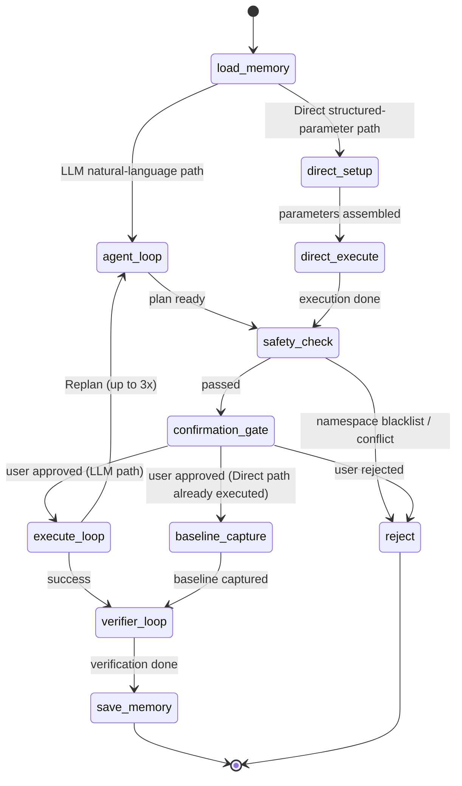

# BLADE AI — Introduction

[](../LICENSE)

**Languages:** [中文](INTRODUCTION.md) | English

> Describe a fault in plain English, no need to memorize CLI flags.

## Table of contents

- [What it is](#what-it-is)
- [Why it exists](#why-it-exists)
- [Capability matrix](#capability-matrix)
- [Architecture overview](#architecture-overview)
- [Three-phase ReAct state machine](#three-phase-react-state-machine)
- [Four-layer defense-in-depth safety](#four-layer-defense-in-depth-safety)
- [Progressive skill loading](#progressive-skill-loading)
- [Three-layer memory system](#three-layer-memory-system)
- [Dual-mode architecture](#dual-mode-architecture)
- [Tech stack](#tech-stack)
- [Boundary with ChaosBlade](#boundary-with-chaosblade)
- [Roadmap](#roadmap)

---

## What it is

**BLADE AI is the orchestration layer on top of the ChaosBlade ecosystem.** It drives ChaosBlade for fault injection at the bottom and adds intent understanding, safety review, effect verification, safe recovery, and structured reporting on top — turning a fault drill from "remember the right command" into "talk to the agent".

It does **not** replace ChaosBlade — ChaosBlade is still the injection engine; BLADE AI is the assistant that makes using it safer and more hands-off:

- **ChaosBlade owns "how to inject"** — how to apply CPU pressure to a Pod in K8s, how to drop 60% of packets on the network
- **BLADE AI owns "how to run a complete drill safely"** — before injection: confirm the target resource exists, is not blacklisted, and does not collide with an in-flight experiment; after injection: verify the fault actually took effect; after the drill: guarantee a reliable recovery

## Why it exists

The point of chaos engineering is not "creating failures" but "verifying the system's resilience under failure". In practice, a complete drill is far more than one `blade create` command — you also need to:

1. Confirm the target resource exists / pin down the exact Pod
2. Confirm the operation is safe (namespace policy, conflict with existing experiments, parameter validity)
3. Verify the effect after injection (not just `blade` returning OK — `kubectl top pod` should actually read 80%)
4. Recover reliably when the drill ends — what if the process crashed, the network blipped, or the blade UID got lost?

These orchestration steps are usually more time-consuming and error-prone than the injection itself. BLADE AI packages the whole flow (**intent → safety → injection → verification → recovery**) into a complete automated loop that never skips a step.

### Why not just "general LLM agent + a ChaosBlade skill"?

A generic agent's "skill" is fundamentally **prompt injection** — it *tells* the LLM what to do. But an LLM can skip, miss, or forget.

BLADE AI's safety checks (resource allowlists, dry-run preview, human-in-the-loop confirmation, timeout-driven recovery) are **embedded into the LangGraph state machine execution engine** — they fire regardless of what the LLM outputs. Similarly, the three recovery outcomes (success / retry-needed / lost-experiment-alarm) are **hard-coded as conditional edges** in the state machine; a linear LLM instruction sequence cannot guarantee the fallback path runs.

> **Skills are the knowledge layer (telling the agent *how*), the agent is the responsibility layer (guaranteeing safe execution and complete recovery). They complement, not substitute.**

---

## Capability matrix

| Capability | Description | Implementation |
|------------|-------------|----------------|
| **Intent understanding** | Natural-language fault description; agent matches a skill and assembles a plan | LLM + skill decision tree |
| **Safety review** | Four-layer defense-in-depth so every injection passes multiple checks | ToolGuard + Safety Check + Confirmation Gate + Loop Max |
| **Fault injection** | Drives ChaosBlade to produce real failures in the K8s cluster | `blade create` / `kubectl` |
| **Effect verification** | Two-layer check confirms the fault actually took effect (operational correctness + semantic reality) | Layer 1 deterministic + Layer 2 semantic |
| **Safe recovery** | Independent recovery flow supporting success / failure / lost branches | Recover graph + force-cleanup fallback |
| **Structured reports** | Every drill emits a complete JSON report for audit and integration | TaskTrace + persisted TaskStore |
| **Observability** | Real-time SSE streaming + token tracking + execution tracing | StatusTracker + TracingCallback |

---

## Architecture overview

```
┌─────────────────────────────────────────────────────────────┐
│                    Entry layer                              │
│   ┌──────────────┐    ┌────────────────────────────────┐   │
│   │ CLI (Typer)  │    │ Server (FastAPI + SSE)         │   │
│   │ AgentRunner  │    │ REST + Stream routes           │   │
│   └──────┬───────┘    └────────────┬───────────────────┘   │
│          │                         │                        │
│          └───────────┬─────────────┘                        │
│                      ▼                                      │
├─────────────────────────────────────────────────────────────┤
│                    Orchestration layer                      │
│   ┌─────────────────────────────────────────────────────┐   │
│   │              LangGraph StateGraph                    │   │
│   │  ┌─────────┐   ┌──────────┐   ┌─────────────────┐  │   │
│   │  │ Phase 1 │ → │ Safety   │ → │ Phase 2         │  │   │
│   │  │ Plan    │   │ Check    │   │ Execute         │  │   │
│   │  └─────────┘   └──────────┘   └─────┬───────────┘  │   │
│   │                                     ▼               │   │
│   │                           ┌─────────────────┐       │   │
│   │                           │ Phase 3         │       │   │
│   │                           │ Verify          │       │   │
│   │                           └─────────────────┘       │   │
│   └─────────────────────────────────────────────────────┘   │
│   AgentState (unified state model) + Router (conditional)   │
├─────────────────────────────────────────────────────────────┤
│                    Capability layer                         │
│   ┌──────────┐  ┌──────────┐  ┌────────────────────────┐   │
│   │ Tools    │  │ Skills   │  │ Memory                 │   │
│   │ Blade    │  │ Tier 1-3 │  │ Working / Session /    │   │
│   │ Kubectl  │  │ progress │  │ Operational Memory     │   │
│   │ Guard    │  │ Registry │  │                        │   │
│   └──────────┘  └──────────┘  └────────────────────────┘   │
├─────────────────────────────────────────────────────────────┤
│                    Infrastructure layer                     │
│   ┌──────────┐  ┌──────────┐  ┌────────────────────────┐   │
│   │ Storage  │  │ Observ.  │  │ Config                 │   │
│   │ SQLite   │  │ Tracer   │  │ pydantic-settings      │   │
│   │ PG(opt.) │  │ Tracker  │  │ 4-tier precedence      │   │
│   │ Checkpt  │  │ Stream   │  │                        │   │
│   └──────────┘  └──────────┘  └────────────────────────┘   │
└─────────────────────────────────────────────────────────────┘
```

---

## Three-phase ReAct state machine

The core is a three-phase ReAct state machine in LangGraph. A complete fault-injection chain is really three sub-tasks of very different character:

- **Phase 1 — Plan**: understand intent → match a skill → query target state → produce an execution plan. Needs rich context (skill catalog, K8s resource info) and gives the LLM room to think
- **Phase 2 — Execute**: call ChaosBlade to create the experiment → validate the return. Needs precise tool calls and strict error handling; no need for verbose context
- **Phase 3 — Verify**: confirm the fault actually took effect → confirm it is recoverable. Has its own time policy (delayed wait, polling retries) — completely different rhythm from the instant feedback of Execute

If one giant ReAct loop handled everything, the prompt would balloon, LLM behavior would get unstable, and error handling would be crude. The value of separating phases: each has its own prompt mode, tool set, and loop ceiling, so the LLM only needs to focus on the task in front of it.



### Key design decisions

- **Dual paths** — LLM path (flexible) + Direct path (deterministic, zero LLM), sharing the same safety review and verification. Both paths converge at `safety_check` — the Direct path only skips LLM planning; **it does not skip any safety stage**
- **Chat routing** — Users often ask "what can you do?" / "what faults do you support?". These non-injection requests should not run the injection flow. The agent detects them and answers conversationally, bypassing safety check + confirmation gate
- **Replan** — Phase 2 failure does not equal task failure. On a recoverable error (target not found, parameter incompatible), the router rewinds back to Phase 1 to replan, up to 3 times. This gives the agent resilience against the dynamic K8s environment
- **Two-layer verification** — Layer 1 confirms the blade experiment was created (deterministic); Layer 2 confirms the fault really took effect (semantic — LLM reads the skill's verification section + kubectl polls). Fault effects have a 5–30 s delay, so Layer 2 uses an "optimistic" strategy: at least 3 checks (≈10 s apart), passes if any one succeeds
- **Independent Recover Graph** — Recovery has its own two-layer verification + `--force` fallback path, supporting both ChaosBlade and non-ChaosBlade (`kubectl scale` / `cordon` / `taint` …) faults

---

## Four-layer defense-in-depth safety

Safety is not a single checkpoint but multiple layers in sequence, each with a clear responsibility boundary:

```
User input
  │
  ▼
┌─────────────────┐
│ 1. ToolGuard    │ ← Command level: allowlist (blade/kubectl/df/ping/sleep)
│                 │   + denylist (rm -rf, | bash, backtick injection)
│                 │   + kubectl subcommand allowlist
└────────┬────────┘
         ▼
┌─────────────────┐
│ 2. Safety Check │ ← Semantic level: namespace blacklist (kube-system blocked by default)
│   (rule engine) │   + conflict detection (overlapping experiments → warning)
│   no LLM        │   + target existence verification
└────────┬────────┘
         ▼
┌─────────────────┐
│ 3. Confirmation │ ← Human level: interrupt() pauses the graph
│    Gate         │   awaits approve / reject
└────────┬────────┘
         ▼
┌─────────────────┐
│ 4. Loop Max     │ ← System level: per-phase loop caps
│                 │   agent≤50, execute≤50, verifier≤30
│                 │   recover verifier≤30, recursion≤150
└─────────────────┘
```

> **Safety Check is a pure rule engine; it does not depend on an LLM — this is a deliberate design decision.**
>
> The LLM may participate in "how to inject" decisions, but it must not participate in "may we inject" rulings. Handing safety review to the LLM is handing the keys to the entity being audited.

---

## Progressive skill loading

Injection knowledge is managed through Skill files, loaded in three tiers to avoid token bloat:

| Tier | When | Loaded content | Token cost |
|------|------|---------------|------------|
| Tier 1 Discovery | Agent startup | frontmatter (name + description) | ~100 tok/skill |
| Tier 2 Activation | LLM calls `activate_skill` | Full SKILL.md body (steps, parameters, verification) | <5000 tok/skill |
| Tier 3 Execution | Referenced by instructions | Specific files under `scripts/`, `references/` | on demand |

**Why not eager-load everything?** Twenty-plus skills' full content would balloon past 100K tokens — expensive *and* it dilutes the LLM's attention on the actual instructions. Progressive loading lets the LLM read the "menu" first (Tier 1), then "order" (Tier 2), then "eat" (Tier 3).

Adding a new fault type is three steps: create a subdir under `skills/` → write a `SKILL.md` → server mode auto-reloads (watchdog with 500ms debounce); CLI mode picks it up on next launch. **No core code change needed.**

---

## Three-layer memory system

| Layer | Name | Storage | Lifetime | Core mechanism |
|-------|------|---------|---------|----------------|
| 1 | Working Memory | In-memory (messages list) | Single graph execution | Tool-output truncation (5000 chars) + token counting |
| 2 | Session Memory | `~/.blade-ai/memory/sessions/` | Single task | LLM-compressed summary (6-section format) + raw JSONL log |
| 3 | Operational Memory | `~/.blade-ai/memory/experiments/` + `AGENT.md` | Cross-task | Experiment history (for conflict detection) + accumulated lessons |

A unified entry point `PreReasoningHook` runs before every LLM inference: truncate tool outputs → count tokens → check context → trigger compaction / persistence. When the estimated token count exceeds `context_max_tokens × compact_ratio` (default 128K × 0.85), the agent calls the LLM to compress message history into a structured summary, preserving three categories (original user intent, executed operations, current state) so the agent still makes correct decisions after compaction.

---

## Dual-mode architecture

```
                ┌─────────────────────────┐
                │    CLI (Typer)          │
                │  config set mode ...    │
                └──────┬──────────┬───────┘
          mode=local   │          │  mode=server
                       ▼          ▼
                ┌──────────┐  ┌──────────┐
                │ AgentRun │  │ AgentCli │
                │  ner     │  │  ent     │
                │ (in-proc)│  │ (HTTP)   │
                └────┬─────┘  └────┬─────┘
                     │             │
                     │      ┌──────▼──────────┐
                     │      │ FastAPI Server  │
                     │      │ + SSE Stream    │
                     │      └──────┬──────────┘
                     │             │
                ┌────▼─────────────▼────┐
                │   Agent Factory       │
                │   (unified graph)     │
                └───────────────────────┘
```

Local mode and Server mode share the **exact same** Agent Core (Graph, State, Router, Tools); they only differ in the entry layer:

- **Local mode** — `AgentRunner` invokes the graph in-process. Best for personal use and CI embedding
- **Server mode** — `AgentClient` talks HTTP to a remote FastAPI. Best for multi-team sharing and upstream platform integration

Switch with `blade-ai config set mode local|server`.

**Graceful shutdown**: in Server mode, `TaskTracker` tracks every live `asyncio.Task`. On SIGTERM: set `shutting_down = true` (reject new requests) → wait for active tasks (up to 30 s) → force-exit on timeout. Checkpoints are saved throughout, so restart resumes seamlessly.

### TUI rendering architecture

The default TUI is TypeScript + Ink (source in `tui/`, embedded into the PyInstaller binary at release time; not separately published to npm currently). It's visually aligned with Claude Code / Qwen Code:

- **TS TUI is the renderer / view layer** — holds no business logic
- **Python is the agent runtime / state machine** — produces the event stream
- They communicate over **HTTP + SSE** with a documented event protocol
- From the user's perspective it's a **single executable** `blade-ai`; it spawns the Python server in the background on launch

| Mode | Trigger | Behavior |
|------|---------|----------|
| Embedded (default) | `blade-ai` | TS CLI spawns `python -m chaos_agent.server.app --port 0`, reads the ready port from stdout, connects |
| Remote | `BLADE_AI_SERVER=http://x:8080 blade-ai` | TS CLI connects directly; no spawn |
| Dev | Terminal 1 runs `blade-ai-server`, Terminal 2 runs `npm run dev` | TS hot-reloads; server is independent |
| Legacy | `BLADE_AI_TUI=legacy blade-ai` | Falls back to the original Python TUI (prompt_toolkit + Rich) |

---

## Tech stack

| Layer | Technology |
|-------|-----------|
| Orchestration engine | LangGraph (StateGraph + interrupt + checkpointer) |
| LLM access | langchain-openai (ChatOpenAI, any OpenAI-compatible endpoint) |
| Injection engine | ChaosBlade v1.8.0 (bundled `blade` binary) |
| TUI framework | TypeScript + Ink + zustand (default); prompt_toolkit + Rich (legacy) |
| HTTP server | FastAPI + uvicorn (REST + SSE streaming) |
| CLI framework | Typer (structured command line) |
| Config | pydantic-settings (4-tier precedence: init args > config.json > env vars > defaults) |
| Storage | SQLite (default) / PostgreSQL (optional) + AsyncSqliteSaver checkpointer |
| Skill hot-reload | watchdog (500ms-debounced auto-reload) |
| Packaging | PyInstaller `--onedir` (manylinux2014 docker for glibc 2.17 baseline historically; now native build) |

---

## Boundary with ChaosBlade

| Dimension | ChaosBlade | BLADE AI |
|-----------|-----------|---------|
| Position | Injection engine | Intelligent orchestration layer |
| Input | Structured commands | Natural language / structured parameters |
| Focus | How to inject | How to safely, completely run a drill |
| Safety | Caller's responsibility | Built-in 4-layer review (command → semantic → human → system) |
| Verification | Returns an exit code | Two-layer (operational correctness + effect reality) |
| Recovery | Provides `blade destroy` | Independent recovery flow + two-layer recovery verification + force-cleanup fallback |
| Auditability | None | 3-layer memory + checkpointer persistence + TaskTrace execution trace |

---

## Roadmap

| Phase | Deliverable | Core capabilities |
|-------|-------------|-------------------|
| Phase 1 (current) | Local CLI + TUI tool | 19 K8s fault scenarios + natural-language chat + 4-layer safety + 2-layer verification + independent recovery + structured reports |
| Phase 2 | Server mode + Web console | FastAPI remote API + web console + multi-team collaboration + audit dashboards |
| Phase 3 | Skill marketplace | Community-contributed skills + auto-generation + review process + `/skills search/install` |
| Phase 4 | Remote sandbox + multi-cluster | Long-running task hosting + cross-cluster coordinated drills + ephemeral resource cleanup |

**Current progress**: the 8 core development phases are complete; the system has end-to-end fault-injection + recovery capability. 80+ test files cover all core modules.

---

## Next steps

- Want to run it → [README_en.md](../README_en.md) Quick start section
- Full usage reference → [docs/USAGE_en.md](USAGE_en.md)
- Fault scenarios cheat sheet → [docs/USAGE_en.md#fault-scenarios](USAGE_en.md#fault-scenarios)
- Server REST + SSE API → [docs/USAGE_en.md#server-mode--api](USAGE_en.md#server-mode--api)
